# Architecture Overview

## System Diagram

```mermaid
flowchart TB
    subgraph Frontend["🎨 Frontend (React + Vite)"]
        UI[Dashboard UI]
        Map[Leaflet Map View]
        Charts[Recharts Visualization]
        API[Axios API Service]
    end

    subgraph Backend["⚙️ Backend (FastAPI)"]
        Routes[API Routes]
        Services[Business Logic]
        ML[ML Predictor]
        Models[SQLAlchemy ORM]
    end

    subgraph Data["💾 Data Layer"]
        DB[(SQLite DB)]
        Model[model.pkl]
        CSV[Training Dataset]
    end

    UI --> API
    Map --> API
    Charts --> API
    API -->|HTTP| Routes
    Routes --> Services
    Services --> ML
    Services --> Models
    ML --> Model
    Models --> DB
    CSV -->|Training| Model
```

## Component Summary

| Component | Technology | Purpose |
|-----------|-----------|---------|
| Frontend | React, Vite, TailwindCSS | Interactive dashboard, maps, charts |
| Backend API | FastAPI | REST endpoints for predictions and alerts |
| ML Engine | scikit-learn RandomForest | Risk classification (low/medium/high) |
| Database | SQLite + SQLAlchemy | Prediction history and alerts |
| Map | Leaflet + react-leaflet | Geographic risk visualization |
| Charts | Recharts | Statistical distribution charts |

## Data Flow

1. User submits environmental data (rainfall, pH, contamination, cases) via the dashboard form
2. Frontend sends POST `/predict` to FastAPI
3. Backend loads the trained RandomForest model and classifies risk
4. Prediction is stored in SQLite along with recommendations
5. If risk = HIGH, an alert is auto-generated
6. Frontend refreshes stats, map, charts, and alert panels
